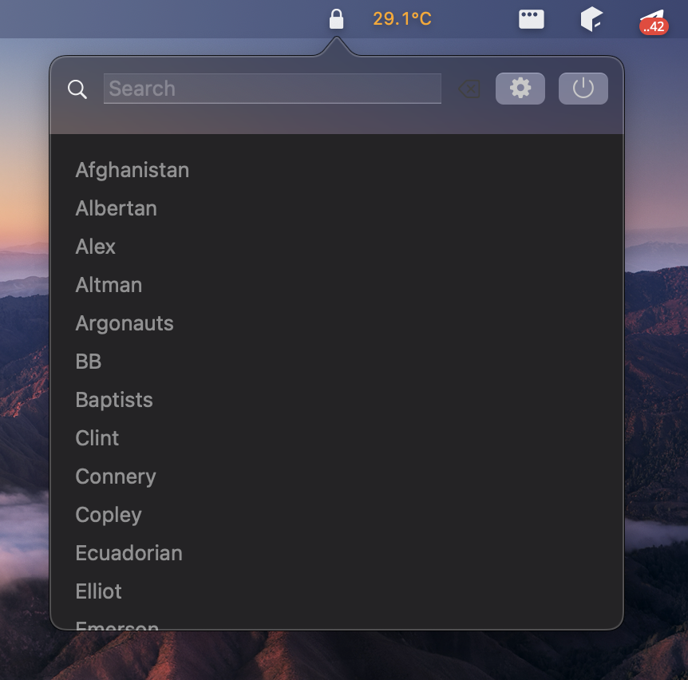
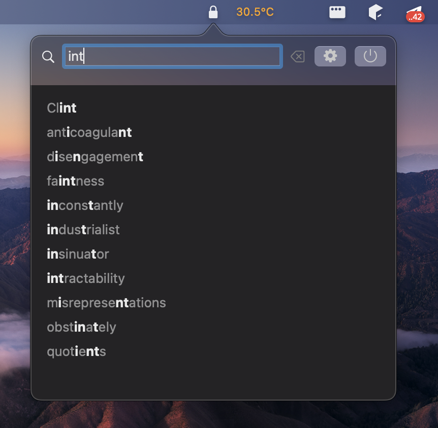
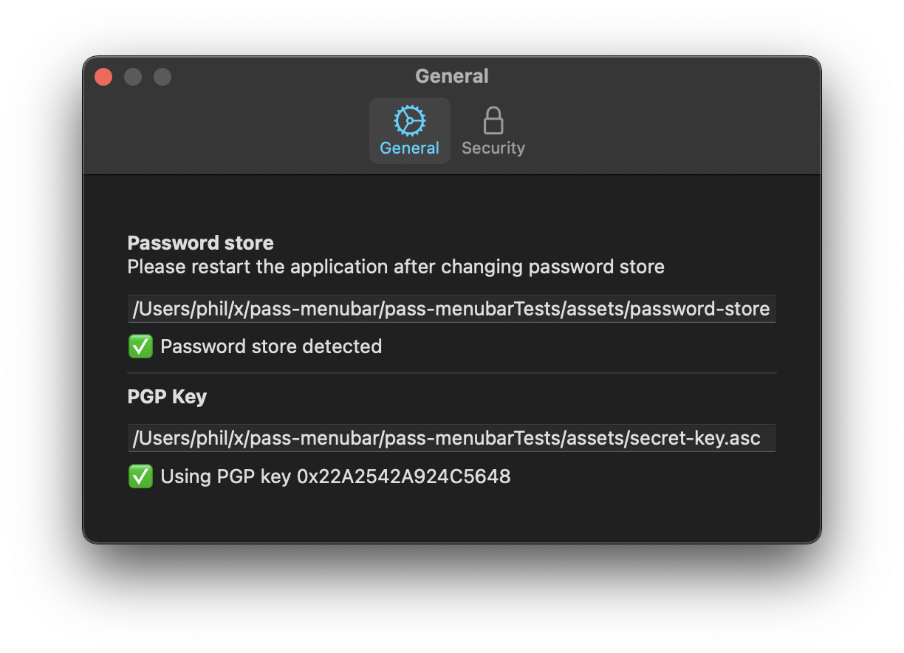
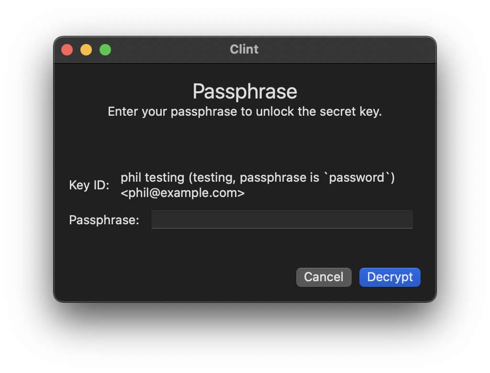
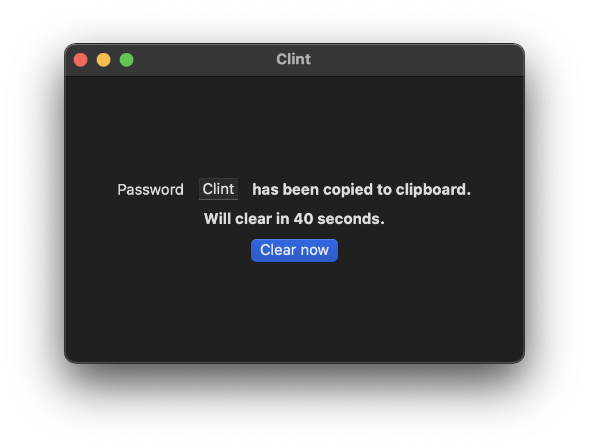

#  pass-menubar

insert description of app

If you do now know about pass, learn more on [passwordstore.org](https://passwordstore.org).

## Features

- Always available in system menubar
- Search to quickly find your password
- Built-in decryption (GPG is not required)
- Automatically copies password in clipboard
- Optional: Use Touch ID to decrypt a password

## Install

I don't know how to package it, so you will need to build it yourself.

If you know how to package an app requiring **Keychain Sharing** capability, let me know!

## Build and runtime requirements

- Xcode version 12.5 or later
- macOS 11.0 (Big Sur) or later
- An Xcode certificate with **Keychain Sharing** capability

## Screenshots

## Technical details

Interface is written in SwiftUI

Libraries used:

- [Files](https://github.com/JohnSundell/Files)
- [KeychainAccess](https://github.com/kishikawakatsumi/KeychainAccess)
- [ObjectivePGP](https://github.com/krzyzanowskim/ObjectivePGP)
